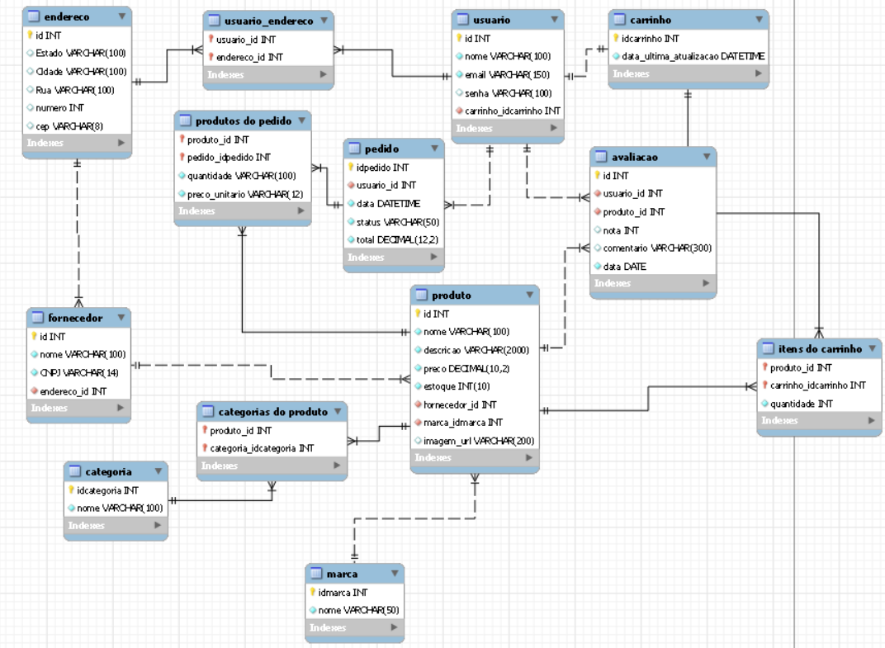

# PI-Descricao
Descrição da disciplina Projeto Integrador 

# Arteliê Online

Um modelo para o desenvolvimento do Projeto Integrador do Curso de Técnico em Desenvolvimento de Sistemas para a Internet Integrado ao Ensino Médio do IFC - Campus Araquari.
Loja Virtual(site de vendas) de itens relacionados a arte.

Professor: [Marco André Mendes](github.com/marcoandre)

Equipe:
- [Gabriel Henrick Martins Gomes](github.com/gabrielmartinsgomes)
- [Guilherme Schreiber](github.com/GuilhermeSchreiber7)
- [Murilo da Cruz Souza](github.com/MuriloDaCruz)
- [Nicolas Steffens Pereira](github.com/SPNicolas)

Links do projeto:
-   [Documentação](https://github.com/Artelie-PI/PI-Descricao)
-   Backend: [Repositório](https://github.com/Artelie-PI/Artelie-BackEnd) e [Publicação](https://artelie-backend.onrender.com/)
-   Frontend: [Repositório](https://github.com/Artelie-PI/Artelie-FrontEnd) e [Publicação](https://artelie-frontend.onrender.com/)

# 1. Desenvolvimento

**1.1.1 Ponto de Vendas (PDV)**

**Loja Virtual para Itens Artistícos e afins**

O Artelie Online será uma loja virtual dedicada exclusivamente à venda de produtos artísticos e itens relacionados a um ateliê de arte. A plataforma permitirá a venda de pinturas, quadrinhos, tintas, materiais de arte e acessórios, oferecendo uma experiência de compra prática e segura. Os clientes poderão navegar por categorias de produtos, realizar buscas avançadas por tipo de arte ou preço, e efetuar compras com facilidade, com opções de pagamento seguras e envio para toda Santa Catarina. O Artelie Online será o destino perfeito para quem deseja adquirir peças de arte e materiais exclusivos, proporcionando uma vivência única aos apreciadores da arte e aos entusiastas do universo artístico.

# 2. Situação Problema

O principal problema enfrentado no mercado de arte é a dificuldade de encontrar recursos artísticos e materiais de arte disponíveis para venda de forma acessível e centralizada. Artistas e consumidores muitas vezes se deparam com a escassez de plataformas digitais que reúnam uma ampla variedade de obras de arte e materiais de qualidade, tornando a busca por esses itens mais difícil e fragmentada. Além disso, muitos artistas, especialmente os independentes, têm dificuldades em comercializar suas obras, enquanto os consumidores encontram obstáculos na hora de adquirir peças ou produtos específicos para suas necessidades criativas. A falta de um mercado digital eficiente e especializado dificulta o acesso a esses recursos essenciais, impactando tanto os criadores quanto os apreciadores da arte.

-   Não se baseamos em alguma empresa. A "nossa" empresa é ficticia.

# 3. Descrição da proposta

O Artelie Online será uma loja virtual dedicada à venda de produtos artísticos, focada em resolver a dificuldade de encontrar e adquirir obras de arte e materiais relacionados. O sistema permitirá que seja comercializada obras de arte, como pinturas, quadrinhos, materiais e ferramentas artísticas, como tintas, pincéis, e acessórios para ateliê. O foco do software será oferecer uma experiência de compra simples, segura e intuitiva para os consumidores, centralizando esses recursos em um único local online.

O sistema terá dois níveis principais de usuários: administradores e clientes. O administrador, responsável pela gestão da plataforma, terá acesso para cadastrar, editar e remover produtos, gerenciar pedidos e acompanhar o desempenho da loja. Já o cliente terá a capacidade de navegar pelos produtos, adicionar itens ao carrinho, finalizar compras e acompanhar seus pedidos.

O software se concentrará em facilitar a busca e a compra de produtos artísticos, permitindo que o cliente filtre por categorias, como tipo de arte, preço ou material, e também terá um processo de pagamento simples e seguro.

# 4. Modelagem de Dados

# 4. Regras de negócio
### **RN001 - Cadastro de Usuário Seguro**
- O e-mail deve ser **único e válido**.
- A senha deve conter:
  - No mínimo 8 caracteres
  - Letras, números e caracteres especiais

---

### **RN002 - Login Seguro**
- O login deve validar corretamente e permitir acesso à área de cliente com alteração de dados pessoais.

---

### **RN003 - Estoque Mínimo**
- O sistema **não pode permitir estoque abaixo de zero**.
- Se o usuário tentar adicionar mais itens ao carrinho do que o disponível, deve ser informado da quantidade restante.
- Ao finalizar um pedido, o estoque deve ser atualizado automaticamente.

---

### **RN004 - Avaliação Média**
- As avaliações devem ser de **1 a 5 estrelas**.
- A **média das avaliações** de um produto deve ser recalculada a cada nova avaliação.

---

### **RN005 - Busca com Filtros**
- O sistema deve permitir busca em **tempo real**, com resposta em até **3 segundos** para até 100 produtos.

---

### **RN006 - Resumo do Carrinho**
- O sistema deve apresentar ao usuário:
  - Lista de produtos
  - Quantidades
  - Preço total
  - Botão “Finalizar compra” (mesmo que ainda não processe pagamento real)

---

### **RN007 - Remoção de Itens do Carrinho**
- O sistema deve permitir que o usuário remova produtos do carrinho individualmente.

---
# 5. Requisitos funcionais
### **RF001 - Cadastro de Usuário**
- O sistema deve permitir o cadastro de usuários com:
  - Nome
  - E-mail (único)
  - Senha
  - Endereço(s)
- **Tabelas relacionadas**: `usuario`, `endereco`
- **Relacionamentos**: Um usuário pode ter vários endereços (1:N)

---

### **RF002 - Login de Usuário**
- O sistema deve permitir login via **e-mail e senha**.
- **Tabela relacionada**: `usuario`

---

### **RF003 - Cadastro de Produtos**
- O sistema deve permitir o cadastro de produtos com:
  - Nome
  - Categoria(s)
  - Preço
  - Quantidade em estoque
  - Marca/Distribuidora
  - Avaliações
- **Tabelas relacionadas**: `produto`, `categoria`, `marca`, `produto_categoria`, `avaliacao`

---

### **RF004 - Métodos de Pagamento**
- O sistema deve suportar os seguintes métodos de pagamento:
  - PIX
  - Boleto bancário
  - Cartão de crédito
- **Tabela sugerida**: `pagamento`
  - `pedido_id`, `metodo_pagamento`, `status_pagamento`, `data_pagamento`

---

### **RF005 - Carrinho de Compras**
- O sistema deve manter um carrinho de compras por usuário, com:
  - Produtos adicionados
  - Quantidade de cada item
  - Preço total
- **Tabelas relacionadas**: `carrinho`, `carrinho_item`

---

### **RF006 - Filtros de Produtos**
- O sistema deve permitir que usuários filtrem produtos por:
  - Categoria (tipo)
  - Marca/Distribuidora
  - Avaliação
  - Faixa de preço

---

# 6. Requisitos não funcionais

### **RNF001 - Performance de Busca**
- O sistema deve permitir buscas em até **3 segundos** e carregar páginas de produto em no máximo **5 segundos**, mesmo com muitos itens na loja.

### **RNF002 - Escalabilidade**
- O sistema deve ser escalável, permitindo a adição de produtos e vendedores sem comprometer o desempenho.

### **RNF003 - Segurança**
- O sistema deve garantir a segurança dos dados dos usuários (criptografia de senha, acesso seguro, etc.).

### **RNF004 - Compatibilidade**
- O sistema deve ser compatível com os principais navegadores (Chrome, Firefox, Edge) e dispositivos móveis.

### **RNF005 - Manutenibilidade**
- O sistema deve ser desenvolvido com **código limpo, modular e bem documentado**, facilitando futuras atualizações e correções.

### **RNF006 - Tecnologia Front-end** 
Para a exibição em front-end, o software utilizará o CSS3, SASS e o HTML5, além do framework Vue.js.
### **RNF003 - Tecnologia Back-end** 
- O software será desenvolvido pela linguagem de 

# 7. Diagrama de Caso de Uso

**7.1 Introdução**

O diagrama de caso de uso é uma ferramenta de modelagem que descreve o comportamento de um sistema a partir da perspectiva do usuário. Ele é usado para capturar os requisitos funcionais de um sistema.

- Especificam a visão externa do sistema.
- Descrevem como o sistema é percebido por seus usuários.
- Descrevem as interações entre os usuários e o sistema.

**Os casos de uso:**
- Descrevem como os **usuários interagem com o sistema** (as funcionalidades do sistema)
- Facilitam a **organização dos requisitos** de um sistema.
- Dão uma **visão externa** do sistema
- O conjunto de casos de uso deve ser capaz de comunicar a **funcionalidade** e o **comportamento** do sistema para o cliente.
- Descrevem **o que** o sistema faz, mas **não** especificam **como** isso deve ser feito.

**7.2 Elementos do diagrama de caso de uso**

7.2.1 **Atores**

- Representam os papéis desempenhados por **elementos externos** ao sistema
  - Ex: humano (usuário), dispositivo de hardware ou outro sistema (cliente)
- Elementos que **interagem** com o sistema

Notação:

**Exemplo: Loja de CDs**

**Identificando os atores**
- Uma loja de CDs possui discos para venda. Um cliente pode comprar uma quantidade ilimitada de discos para isto ele deve se dirigir à loja.
- A loja possui um **atendente** cuja função é atender os clientes durante a venda dos discos. A loja também possui um **gerente** cuja função é administrar o estoque para que não faltem discos. Além disso é ele quem dá folga ao atendente, ou seja, ele também atende os clientes durante a venda dos discos.

**E o cliente?**
- Não é ator pois ele **não interage** com o sistema!

**7.2.2 Casos de uso**

- Representam **funcionalidades** do sistema (requisitos funcionais).
- São iniciados por **atores** ou por outros casos de uso.

> **Dica**: nomeie os casos de uso com **verbos** no **infinitivo**.

Notação:

**Exemplo: Loja de CDs**

**Identificando os casos de uso**

- Uma loja de CDs possui discos para venda. Um cliente pode comprar uma quantidade ilimitada de discos para isto ele deve se dirigir à loja. A loja possui um atendente cuja função é atender os clientes durante a **venda dos discos**.
- A loja também possui um gerente cuja função é **administrar o estoque** para que não faltem discos. Além disso é ele quem dá folga ao atendente, ou seja, ele também atende os clientes durante a **venda dos discos**.

**7.2.3 Relacionamentos**

**7.2.3.1 Relacionamento de associação**

- Indica que um ator **participa** de um caso de uso, ou seja, o ator **interage** (comunica-se) com o caso de uso.
- É representado por uma **linha sólida**.
- Um ator pode se relacionar com **um ou mais casos de uso**.

> Dicas:
> - Não use setas nas linhas de associação.
> - Associações não representam fluxo de informação.

**Exemplo: Loja de CDs**

**Identificando os relacionamentos de associação**

- Uma loja de CDs possui discos para venda. Um cliente pode comprar uma quantidade ilimitada de discos para isto ele deve se dirigir à loja. A loja possui um _atendente_ cuja função é atender os clientes durante a **venda dos discos**.
- A loja também possui um _gerente_ cuja função é **administrar o estoque** para que não faltem discos. Além disso é ele quem dá folga ao _atendente_, ou seja, ele também atende os clientes durante a **venda dos discos**.

**7.2.3.2 Relacionamento de generalização/especialização**

**Generalização de atores**

- Quando dois ou mais atores podem se **comunicar com o mesmo conjunto de casos de uso**.
- Indica que um ator **herda** as características de outro ator.
– Um filho (herdeiro) pode se comunicar com todos os casos de uso que seu pai se comunica.

> **Dica:** coloque os herdeiros **embaixo**.

**Notação:**

**Exemplo: Loja de CDs**

**Identificando os relacionamentos de generalização/especialização de atores**

**Generalização de casos de uso**

– O caso de uso filho herda o comportamento e o significado do caso de uso pai.
– O caso de uso filho pode incluir ou sobrescrever o comportamento do caso de uso pai.
– O caso de uso filho pode substituir o caso de uso pai em qualquer lugar que ele apareça.

> **Dica:** deve ser aplicada quando uma condição resulta na definição de
diversos fluxos alternativos.

Notação:

**Exemplo: Loja de CDs**

**Identificando os relacionamentos de generalização/especialização de casos de uso**

**Novos requisitos:**

- As vendas podem ser **à vista** ou **a prazo**. Em ambos os casos o estoque é
atualizado e uma nota fiscal, entregue ao consumidor.
- No caso de uma **venda à vista**, clientes cadastrados na loja e que compram mais de 5 CDs de uma só vez ganham um desconto de 1% para cada ano de cadastro.
- No caso de uma **venda a prazo**, ela pode ser parcelada em 2 pagamentos com um
acréscimo de 20%. As vendas a prazo podem ser pagas no **cartão** ou no **boleto**.
  - Para pagamento com **boleto**, são gerados boletos bancários que são entregues ao cliente e armazenados no sistema para lançamento posterior no caixa.
  - Para pagamento com **cartão**, os clientes com mais de 10 anos de cadastro na loja ganham o mesmo desconto das compras à vista.

**Identificando mais relacionamentos de generalização/especialização de casos de uso**

**7.2.3.3 Relacionamento de dependência**

**Extensão**

- Representa uma variação/extensão do comportamento do caso de uso base.
- O caso de uso estendido só é executado sob certas circunstâncias.
- Separa partes obrigatórias de partes opcionais.
  - Partes obrigatórias: caso de uso base.
  - Partes opcionais: caso de uso estendido.
- Fatorar comportamentos variantes do sistema (podendo reusar este comportamento
em outros casos de uso).

**Notação:**

 - notação")

**Exemplo: Loja de CDs**

**Identificando os relacionamentos de dependência (extensão)**

**Novos requisitos:**
- No caso de uma venda à vista, clientes cadastrados na loja e que compram mais
de 5 CDs de uma só vez ganham um **desconto** de 1% para cada ano de cadastro.
- No caso de uma venda a prazo...
  - ...Para pagamento com cartão, os clientes com mais de 10 anos de cadastro na loja ganham o mesmo **desconto** das compras à vista.

")

**Inclusão**

- Evita repetição ao fatorar uma atividade
comum a dois ou mais casos de uso.
- Um caso de uso pode incluir vários casos de uso.

**Notação:**

 - notação")

**Exemplo: Loja de CDs**

**Novos requisitos:**
Para efetuar vendas ou administrar estoque, atendentes e gerentes terão que **validar** suas respectivas senhas de
acesso ao sistema.

")

**7.2.4 Fronteira do sistema**

- Elemento opcional (mas essencial para um bom
entendimento).
- Serve para definir a área de atuação do sistema, ou seja, seus limites.

**Identificando a fronteira do sistema**

---

